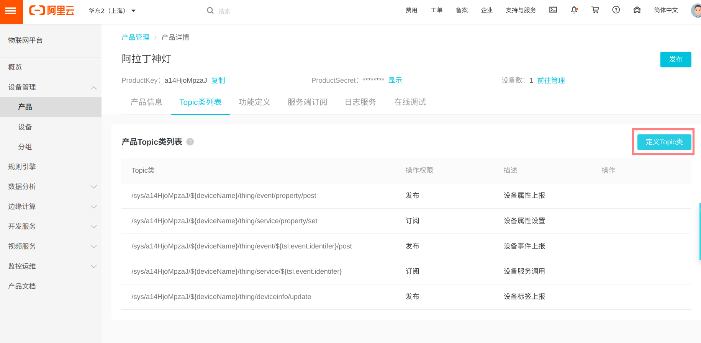
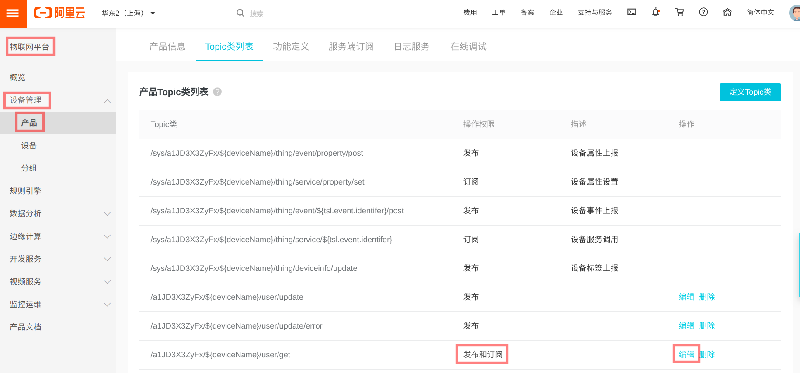

# 更新

- 参照帮助文档，在阿里云IoT平台建立产品和设备，并且创建自定义的Topic列表[阿里云物联网平台说明](https://help.aliyun.com/document_detail/96624.html?spm=a2c4g.11186623.6.554.3e59492bCMVyqA)

  

- ESP-IDF

  - https://dl.espressif.com/dl/esp-idf/releases/esp-idf-v3.2.zip

- Compile tool

  https://dl.espressif.com/dl/esp32_win32_msys2_environment_and_toolchain-20181001.zip

- 以==**esp-aliyun\examples\mqtt\mqtt_example**==为例 

编译下载，即可。注意为了接入成功还需要一下步骤：

参考 [量产说明](https://github.com/espressif/esp-aliyun/blob/master/config/mass_mfg/README.md) 文档烧录**四元组** NVS 分区。参课这个文档吧几个key替换为自己设备的key。

在mysy32中如下路径：\esp-aliyun\config\mass_mfg，执行 

```
$IDF_PATH/components/nvs_flash/nvs_partition_generator/nvs_partition_gen.py --input myesp32_single_mfg_config.csv --output myesp32_single_mfg.bin --size 0x4000 $IDF_PATH/components/esptool_py/esptool/esptool.py write_flash 0x210000 myesp32_single_mfg.bin
```

- 编译烧写固件

  ```
  make chip=esp32 defconfig
  make menuconfig -j8
  make flash monitor -j8
  ```

  

- esp32运行日志

  ```c
  I (4263) event: sta ip: 192.168.31.7, mask: 255.255.255.0, gw: 192.168.31.1
  mqtt_main|157 :: mqtt example
  [wrn] IOT_MQTT_Construct(467): Using default hostname: 'a1Baj2iis4G.iot-as-mqtt.cn-shanghai.aliyuncs.com'
  [wrn] IOT_MQTT_Construct(474): Using default port: [443]
  [wrn] IOT_MQTT_Construct(481): Using default client_id: a1Baj2iis4G.esp32-basic|timestamp=2524608000000,securemode=2,signmethod=hmacsha256,gw=0,ext=0,_v=sdk-c-3.0.1|
  [wrn] IOT_MQTT_Construct(488): Using default username: esp32-basic&a1Baj2iis4G
  [wrn] IOT_MQTT_Construct(496): Using default password: ******
  [wrn] IOT_MQTT_Construct(509): Using default request_timeout_ms: 2000, configured value(0) out of [500, 5000]
  [wrn] IOT_MQTT_Construct(524): Using default keepalive_interval_ms: 60000, configured value(0) out of [30000, 180000]
  [wrn] IOT_MQTT_Construct(530): Using default read_buf_size: 1024
  [wrn] IOT_MQTT_Construct(536): Using default write_buf_size: 1024
  [inf] iotx_mc_init(230): MQTT init success!
  [inf] _mqtt_connect(778): connect params: MQTTVersion=4, clientID=a1Baj2iis4G.esp32-basic|timestamp=2524608000000,securemode=2,signmethod=hmacsha256,gw=0,ext=0,_v=sdk-c-3.0.1|,
  keepAliveInterval=60, username=esp32-basic&a1Baj2iis4G
  [inf] _mqtt_connect(821): mqtt connect success!
  [inf] wrapper_mqtt_subscribe(2879): mqtt subscribe packet sent,topic = /a1Baj2iis4G/esp32-basic/get!
  [inf] wrapper_mqtt_subscribe(2879): mqtt subscribe packet sent,topic = /a1Baj2iis4G/esp32-basic/data!
  example_event_handle|130 :: msg->event_type : 9
  example_event_handle|130 :: msg->event_type : 3
  example_event_handle|130 :: msg->event_type : 3
  example_event_handle|130 :: msg->event_type : 9
  example_message_arrive|030 :: Message Arrived:
  example_message_arrive|031 :: Topic  : /a1Baj2iis4G/esp32-basic/data
  example_message_arrive|032 :: Payload: {"message":"hello!"}
  example_message_arrive|033 ::
  
  example_message_arrive|030 :: Message Arrived:
  example_message_arrive|031 :: Topic  : /a1Baj2iis4G/esp32-basic/data
  example_message_arrive|032 :: Payload: {"message":"hello!"}
  example_message_arrive|033 ::
  
  [inf] iotx_mc_keepalive_sub(1699): send MQTT ping...
  [inf] iotx_mc_cycle(1570): receive ping response!
  example_message_arrive|030 :: Message Arrived:
  example_message_arrive|031 :: Topic  : /a1Baj2iis4G/esp32-basic/data
  example_message_arrive|032 :: Payload: {"message":"hello!"}
  example_message_arrive|033 ::
  
  [inf] iotx_mc_keepalive_sub(1699): send MQTT ping...
  example_message_arrive|030 :: Message Arrived:
  example_message_arrive|031 :: Topic  : /a1Baj2iis4G/esp32-basic/data
  example_message_arrive|032 :: Payload: {"message":"hello!"}
  example_message_arrive|033 ::
  
  ```

  


# MQTT 解决方案

### 介绍
`mqtt_example` 为客户提供连接阿里云, 演示发布和订阅功能.

### 解决方案部署
#### 1.参考 [README](../../../README.md) 文档进行硬件准备、环境搭建、SDK 准备

#### 2.阿里云平台部署
在阿里云 [物联网平台](https://iot.console.aliyun.com) 上创建产品. 产品 Topic 类列表如下:


如果已在阿里云 [生活物联网平台](https://living.aliyun.com/#/) 创建产品, 会显示在 `物联网平台`, 但需要手动增加 Topic 类 `/${productKey}/${deviceName}/user/get` .


修改 Topic `/${productKey}/${deviceName}/user/get` 的操作权限为 `发布和订阅`. 这样 MQTT 客户端可以收到自己发布的消息.


> 创建产品设备后,可以获取`三元组`, 后续需要烧录到 NVS 分区.

#### 3.下载本工程
   ```
    git clone https://github.com/espressif/esp-aliyun.git
    cd esp-aliyun
   ```

#### 4.烧录三元组信息
- 参考 [量产说明](../../../config/mass_mfg/README.md) 文档烧录三元组 NVS 分区。

> 如果执行了 `make erase_flash`, 需要重新烧录三元组.

#### 5.编译 `mqtt_example` 并烧录运行
```
cd examples/mqtt/mqtt_example
make chip=esp32 defconfig 或者 make chip=esp8266 defconfig
make menuconfig
```


- 配置烧写串口
- 配置 `WIFI_SSID`, `WIFI_PASSWORD`

```
make -j8 flash monitor
```

#### 6.设备运行

设备连接 WIFI 之后, 进行 MQTT 连接, 订阅和发布消息. 订阅和发布的 Topic 都是 `/${productKey}/${deviceName}/user/get` , 因此设备会收到自己发送的消息.


